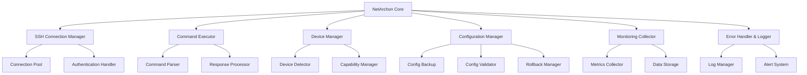

# NetArchon Core Design Document

## Overview

NetArchon Core is the foundational module that provides secure SSH connectivity, command execution, and basic device management capabilities. This design focuses on the "Crawl" milestone - establishing the core infrastructure needed for all higher-level network engineering functions. The architecture emphasizes simplicity, reliability, and extensibility to support the five functional pillars of NetArchon.

## Architecture

### High-Level Architecture



### Core Components

1. **SSH Connection Manager**: Handles all SSH connectivity with connection pooling and authentication
2. **Command Executor**: Executes commands on devices with proper error handling and response processing
3. **Device Manager**: Detects device types and manages device-specific behaviors
4. **Configuration Manager**: Safely manages device configurations with backup and rollback capabilities
5. **Monitoring Collector**: Collects basic network metrics and status information
6. **Error Handler & Logger**: Provides comprehensive logging and error management

## Components and Interfaces

### SSH Connection Manager

**Purpose**: Establish and maintain secure SSH connections to network devices

**Key Classes**:
- `SSHConnector`: Core SSH connection functionality
- `ConnectionPool`: Manages multiple concurrent connections
- `AuthenticationHandler`: Handles various authentication methods

**Interfaces**:
```python
class SSHConnector:
    def connect(self, host: str, username: str, password: str, port: int = 22) -> Connection
    def disconnect(self, connection: Connection) -> None
    def is_connected(self, connection: Connection) -> bool
    def test_connection(self, connection: Connection) -> bool

class ConnectionPool:
    def get_connection(self, device_id: str) -> Connection
    def release_connection(self, device_id: str) -> None
    def cleanup_idle_connections(self) -> None
```

### Command Executor

**Purpose**: Execute commands on network devices with proper error handling

**Key Classes**:
- `CommandExecutor`: Main command execution logic
- `CommandParser`: Parses and validates commands
- `ResponseProcessor`: Processes command responses

**Interfaces**:
```python
class CommandExecutor:
    def execute_command(self, connection: Connection, command: str, timeout: int = 30) -> CommandResult
    def execute_commands(self, connection: Connection, commands: List[str]) -> List[CommandResult]
    def execute_with_privilege(self, connection: Connection, command: str, enable_password: str) -> CommandResult

class CommandResult:
    success: bool
    output: str
    error: str
    execution_time: float
    timestamp: datetime
```

### Device Manager

**Purpose**: Detect and classify network devices, manage device-specific behaviors

**Key Classes**:
- `DeviceDetector`: Identifies device types and capabilities
- `DeviceProfile`: Stores device-specific information and behaviors
- `CapabilityManager`: Manages device capabilities and command syntax

**Interfaces**:
```python
class DeviceDetector:
    def detect_device_type(self, connection: Connection) -> DeviceType
    def get_device_info(self, connection: Connection) -> DeviceInfo
    def create_device_profile(self, connection: Connection) -> DeviceProfile

class DeviceProfile:
    device_type: DeviceType
    vendor: str
    model: str
    os_version: str
    capabilities: List[str]
    command_syntax: Dict[str, str]
```

### Configuration Manager

**Purpose**: Safely manage device configurations with backup and rollback

**Key Classes**:
- `ConfigManager`: Main configuration management logic
- `ConfigBackup`: Handles configuration backups
- `ConfigValidator`: Validates configuration syntax
- `RollbackManager`: Manages configuration rollbacks

**Interfaces**:
```python
class ConfigManager:
    def backup_config(self, connection: Connection) -> ConfigBackup
    def apply_config(self, connection: Connection, config: str, backup_first: bool = True) -> bool
    def rollback_config(self, connection: Connection, backup: ConfigBackup) -> bool
    def validate_config(self, config: str, device_type: DeviceType) -> ValidationResult
```

## Data Models

### Core Data Structures

```python
@dataclass
class DeviceInfo:
    hostname: str
    ip_address: str
    device_type: DeviceType
    vendor: str
    model: str
    os_version: str
    last_seen: datetime
    status: DeviceStatus

@dataclass
class ConnectionInfo:
    device_id: str
    host: str
    port: int
    username: str
    connection_type: str
    established_at: datetime
    last_activity: datetime

@dataclass
class MetricData:
    device_id: str
    metric_type: str
    value: Union[int, float, str]
    timestamp: datetime
    unit: str

@dataclass
class ConfigBackup:
    device_id: str
    config_content: str
    backup_time: datetime
    backup_reason: str
    checksum: str
```

### Enumerations

```python
class DeviceType(Enum):
    CISCO_IOS = "cisco_ios"
    CISCO_NXOS = "cisco_nxos"
    JUNIPER_JUNOS = "juniper_junos"
    ARISTA_EOS = "arista_eos"
    GENERIC = "generic"

class DeviceStatus(Enum):
    ONLINE = "online"
    OFFLINE = "offline"
    UNREACHABLE = "unreachable"
    UNKNOWN = "unknown"

class LogLevel(Enum):
    DEBUG = "debug"
    INFO = "info"
    WARNING = "warning"
    ERROR = "error"
    CRITICAL = "critical"
```

## Error Handling

### Error Categories

1. **Connection Errors**: SSH connection failures, timeouts, authentication issues
2. **Command Errors**: Command execution failures, syntax errors, privilege issues
3. **Configuration Errors**: Invalid configurations, rollback failures, backup issues
4. **Device Errors**: Device detection failures, unsupported devices
5. **System Errors**: Internal application errors, resource exhaustion

### Error Handling Strategy

```python
class NetArchonError(Exception):
    """Base exception for NetArchon"""
    pass

class ConnectionError(NetArchonError):
    """SSH connection related errors"""
    pass

class CommandExecutionError(NetArchonError):
    """Command execution related errors"""
    pass

class ConfigurationError(NetArchonError):
    """Configuration management related errors"""
    pass

class DeviceError(NetArchonError):
    """Device detection and management related errors"""
    pass
```

### Error Recovery Mechanisms

- **Automatic Retry**: Configurable retry logic for transient failures
- **Circuit Breaker**: Prevent cascading failures by temporarily disabling failing connections
- **Graceful Degradation**: Continue operation with reduced functionality when possible
- **Rollback Capability**: Automatic rollback for configuration changes that cause issues

## Testing Strategy

### Unit Testing

- **SSH Connector Tests**: Mock SSH connections, test authentication, connection pooling
- **Command Executor Tests**: Test command execution, error handling, response processing
- **Device Manager Tests**: Test device detection, profile creation, capability management
- **Configuration Manager Tests**: Test backup, apply, rollback, validation operations

### Integration Testing

- **End-to-End Connection Tests**: Test full SSH connection workflow with real devices
- **Command Execution Integration**: Test command execution across different device types
- **Configuration Management Integration**: Test full configuration lifecycle

### Test Infrastructure

```python
class MockSSHConnection:
    """Mock SSH connection for testing"""
    def execute_command(self, command: str) -> str:
        # Return predefined responses based on command
        pass

class DeviceSimulator:
    """Simulate different device types for testing"""
    def simulate_cisco_ios(self) -> MockSSHConnection:
        pass
    
    def simulate_juniper_junos(self) -> MockSSHConnection:
        pass
```

### Testing Approach

1. **Test-Driven Development**: Write tests before implementation
2. **Mock External Dependencies**: Use mocks for SSH connections and device interactions
3. **Comprehensive Coverage**: Aim for >90% code coverage
4. **Performance Testing**: Test connection pooling and concurrent operations
5. **Error Scenario Testing**: Test all error conditions and recovery mechanisms

## Implementation Notes

### Technology Stack

- **Language**: Python 3.9+
- **SSH Library**: Paramiko for SSH connectivity
- **Async Support**: asyncio for concurrent operations
- **Logging**: Python logging module with structured logging
- **Testing**: pytest for unit and integration testing
- **Configuration**: YAML/JSON for configuration files

### Project Structure

```
src/
├── netarchon/
│   ├── __init__.py
│   ├── core/
│   │   ├── __init__.py
│   │   ├── ssh_connector.py
│   │   ├── command_executor.py
│   │   ├── device_manager.py
│   │   ├── config_manager.py
│   │   └── monitoring.py
│   ├── models/
│   │   ├── __init__.py
│   │   ├── device.py
│   │   ├── connection.py
│   │   └── metrics.py
│   ├── utils/
│   │   ├── __init__.py
│   │   ├── logger.py
│   │   └── exceptions.py
│   └── config/
│       ├── __init__.py
│       └── settings.py
tests/
├── unit/
├── integration/
└── fixtures/
docs/
├── activity.md
└── api/
tasks/
└── todo.md
```

### Development Principles

1. **Simplicity First**: Write the simplest code that works
2. **Atomic Changes**: Each commit represents a single logical change
3. **Comprehensive Logging**: Log all significant operations and errors
4. **Fail Fast**: Detect and report errors as early as possible
5. **Extensible Design**: Design for future expansion of the five pillars