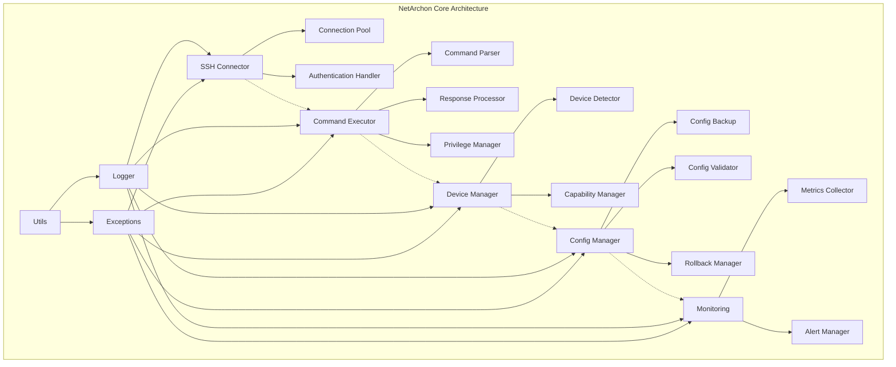

# NetArchon AI Network Engineer - Complete Development Guide

## Project Overview
NetArchon is an autonomous AI agent designed to embody the complete skill set of a senior network engineer. The goal is to create an AI capable of designing, implementing, managing, and securing computer networks with a focus on Monitoring-as-a-Service (MaaS) capabilities.

**Current Status**: 10/18 tasks complete (55%) with critical implementation gaps identified.
**Architecture**: Built around five core functional pillars representing the complete network engineering skill set.
**Foundation**: Robust 1,685-line codebase with 3,315 lines of comprehensive tests.

## The Five Pillars Architecture

NetArchon is built around **five core functional pillars** that represent the complete skill set of a senior network engineer:

### 1. Design & Planning (The Architect) 🏗️
**Vision**: Interprets requirements to design robust network architectures
- Network topology design and IP addressing schemes
- Hardware recommendations and capacity planning  
- Configuration template generation
- Infrastructure documentation and diagrams

### 2. Implementation & Deployment (The Builder) 🔧
**Vision**: Uses automation tools to deploy and validate network configurations
- **✅ CURRENT STATUS**: Core foundation complete
  - SSH connectivity with pooling (`ssh_connector.py`)
  - Command execution framework (`command_executor.py`)
  - Device detection and management (`device_manager.py`)
- **🎯 NEXT**: Configuration deployment with rollback safety

### 3. Operations & Maintenance (The Guardian) 🛡️
**Vision**: Ensures 24/7 network reliability through monitoring and automation
- **🎯 PRIORITY**: Real-time monitoring and metrics collection
- Automated root cause analysis and incident response
- Integration with ticketing systems (Jira, ServiceNow)
- Performance baseline establishment

### 4. Security & Compliance (The Sentinel) 🔒
**Vision**: Protects the network through security automation
- Firewall rule and ACL management
- Security audit automation and compliance reporting
- Traffic analysis and threat detection
- Vulnerability assessment and remediation

### 5. MaaS & Insights (The Analyst) 📊
**Vision**: Transforms raw network data into strategic intelligence
- **🎯 KEY DIFFERENTIATOR**: ML-based predictive analytics
- Performance trending and capacity forecasting
- Network optimization recommendations
- Executive dashboards and reporting

## CRITICAL DISCOVERY: Official Specifications Found

**⚠️ IMPORTANT**: The `.kiro/specs/netarchon-core/` directory contains the official project specifications that define the true implementation requirements.

### Official Task Status (Based on .kiro/specs/netarchon-core/tasks.md)

#### ✅ COMPLETED (Tasks 1-10) - 55% Complete
According to the official specifications, **Task 10 is marked as COMPLETED** but our analysis shows `config_manager.py` is empty.

### ✅ COMPLETED CORE INFRASTRUCTURE (Tasks 1-10)
- **SSH Connectivity** (`ssh_connector.py`) - 408 lines
  - Connection pooling with reuse and cleanup
  - Retry logic with exponential backoff
  - Support for password and key-based authentication
  
- **Command Execution** (`command_executor.py`) - 538 lines
  - Secure command validation and sanitization
  - Privilege escalation with enable mode support
  - Batch command execution with error handling
  - ANSI sequence cleaning and metadata extraction

- **Device Management** (`device_manager.py`) - 734 lines
  - Multi-vendor device detection (Cisco IOS/NX-OS, Juniper JUNOS, Arista EOS)
  - Device capability management and command syntax adaptation
  - Confidence-based device classification

- **Data Models** (347 lines total)
  - `device.py` - DeviceInfo, DeviceProfile, DeviceType enums
  - `connection.py` - ConnectionInfo, CommandResult, AuthenticationCredentials
  - `metrics.py` - MetricData, InterfaceMetrics, SystemMetrics

- **Utilities** (225 lines total)
  - `exceptions.py` - Comprehensive exception hierarchy
  - `logger.py` - Structured JSON logging with rotation

- **Test Suite** - 3,315 lines across 8 test files (96% pass rate)

### ❌ INCOMPLETE IMPLEMENTATION
- **Task 10: Configuration Management** - Marked complete in specs but `config_manager.py` is empty (0 lines)

### 🎯 REMAINING OFFICIAL TASKS (Tasks 11-18) - 45% Remaining
According to `.kiro/specs/netarchon-core/tasks.md`:

#### Priority 1: Core Functionality (Tasks 11-13)
- **Task 11**: Configuration deployment and rollback - _Requirements: 4.2, 4.3, 4.4, 4.5_
- **Task 12**: Basic monitoring and metrics collection - _Requirements: 5.1, 5.2, 5.5_  
- **Task 13**: Monitoring data processing and alerting - _Requirements: 5.3, 5.4_

#### Priority 2: System Robustness (Tasks 14-15)
- **Task 14**: Comprehensive error handling and recovery - _Requirements: 6.1, 6.2, 6.3_
- **Task 15**: Configuration and settings management - _Requirements: 6.4, 7.4_

#### Priority 3: Quality & Documentation (Tasks 16-18)
- **Task 16**: Integration test suite and examples - _Requirements: 1.1, 2.1, 3.1, 4.1, 5.1_
- **Task 17**: Development workflow automation - _Requirements: 7.3, 7.4, 7.5_
- **Task 18**: Comprehensive documentation and examples - _Requirements: 7.2, 7.5_

## ESSENTIAL DEVELOPMENT WORKFLOW 🔥

**CRITICAL**: These principles must be followed for ALL NetArchon development work.

### 1. Initial Analysis and Planning
- **First**: Think through the problem completely
- **Read**: Examine the codebase for relevant files and context
- **Plan**: Write a detailed plan to `tasks/todo.md` with checkboxes

### 2. Todo List Structure
- The plan MUST have a list of todo items that can be checked off as completed
- Use markdown checkboxes: `- [ ]` for pending, `- [x]` for complete
- Each item should be atomic and represent a single, logical change

### 3. Plan Verification
- **MANDATORY**: Before beginning any work, present the plan for verification
- Do NOT proceed with execution until the plan is approved
- This prevents wasted effort and ensures alignment

### 4. Task Execution
- Work through todo items systematically 
- Mark items as complete (`- [x]`) as you finish them
- Follow the Simplicity Principle for every change

### 5. Communication Protocol
- **Every step**: Provide high-level explanation of changes made
- Keep communication concise but informative
- Focus on WHAT was changed, not detailed implementation

### 6. Simplicity Principle ⭐
**MOST IMPORTANT**: Make every task and code change as simple as possible
- Avoid massive or complex changes at all costs
- Every change should impact as little code as possible
- Break large changes into smaller, atomic steps
- **Everything is about simplicity**

### 7. Process Documentation
- **Every action**: Write a log to `docs/activity.md`
- Read `docs/activity.md` when needed for context
- Maintain comprehensive activity tracking
- Document commands run, files edited, commits made

### 8. Review Process
- **Finally**: Add a review section to `todo.md` 
- Summarize all changes made
- Include any other relevant information
- Complete the development cycle documentation

## Development Commands

### Testing
```bash
# Run all tests
python3 -m pytest tests/ -v

# Run specific test file
python3 -m pytest tests/unit/test_ssh_connector.py -v

# Run with coverage
python3 -m pytest tests/ --cov=src/netarchon --cov-report=html
```

### Git Workflow
```bash
# Check status
git status

# Stage and commit changes
git add .
git commit -m "feat: description of changes"

# Push to remote
git push origin main
```

## DETAILED ARCHITECTURE OVERVIEW

### Current Implementation Status (38 files, 18 directories)

```
NetArchon/
├── .claude/settings.local.json     # Claude Code permissions
├── .kiro/specs/netarchon-core/      # Official specifications 
│   ├── design.md                   # Architecture design (343 lines)
│   ├── requirements.md             # Requirements spec (91 lines)
│   └── tasks.md                    # Official task list (126 lines)
├── src/netarchon/                   # Main source code (1,685 lines)
│   ├── __init__.py                 # Package metadata (9 lines)
│   ├── core/                       # Core networking functionality
│   │   ├── __init__.py            # Core module doc (6 lines)
│   │   ├── ssh_connector.py       ✅ SSH + ConnectionPool (408 lines)
│   │   ├── command_executor.py    ✅ Commands + Privilege (538 lines)
│   │   ├── device_manager.py      ✅ Detection + Capabilities (734 lines)
│   │   └── config_manager.py      ❌ EMPTY - Critical gap (0 lines)
│   ├── models/                     # Data structures (347 lines total)
│   │   ├── __init__.py            # Models documentation (5 lines)
│   │   ├── device.py              ✅ DeviceInfo + Profile (90 lines)
│   │   ├── connection.py          ✅ ConnectionInfo + Results (114 lines)
│   │   └── metrics.py             ✅ MetricData + System (143 lines)
│   ├── utils/                      # Utilities (225 lines total)
│   │   ├── __init__.py            # Utils documentation (5 lines)
│   │   ├── exceptions.py          ✅ Exception hierarchy (78 lines)
│   │   └── logger.py              ✅ Structured logging (147 lines)
│   └── config/                     # Configuration management
│       └── __init__.py            ✅ Config documentation (5 lines)
├── tests/unit/                      # Test suite (3,315 lines total)
│   ├── __init__.py                # Test package (2 lines)
│   ├── test_ssh_connector.py      # SSH tests (678 lines)
│   ├── test_command_executor.py   # Command tests (592 lines)
│   ├── test_device_manager.py     # Device tests (695 lines)
│   ├── test_device_models.py      # Device model tests (227 lines)
│   ├── test_connection_models.py  # Connection tests (336 lines)
│   ├── test_metrics_models.py     # Metrics tests (480 lines)
│   ├── test_exceptions.py         # Exception tests (125 lines)
│   └── test_logger.py             # Logger tests (180 lines)
├── docs/activity.md                # Development log (236 lines)
├── tasks/todo.md                   # Task tracking
├── README.md                       # Basic project info (3 lines)
├── CLAUDE.md                       # This comprehensive guide
└── .gitignore                      # Git exclusions (67 lines)
```

### Component Interaction Diagram



### Data Flow Architecture

```
1. Connection Establishment
   SSH Connector → Authentication → Connection Pool → Device Detection

2. Command Execution
   Command Parser → Privilege Check → SSH Channel → Response Processing

3. Configuration Management
   Backup Creation → Validation → Deployment → Monitoring → Rollback (if needed)

4. Monitoring Pipeline
   Metrics Collection → Data Processing → Storage → Alerting → Dashboard

5. Error Handling
   Exception Capture → Logging → Recovery Attempt → Circuit Breaker → Graceful Degradation
```

## Official Requirements Analysis

### Requirement Coverage Status
Based on `.kiro/specs/netarchon-core/requirements.md`:

#### ✅ FULLY IMPLEMENTED
- **Requirement 1**: Core SSH Connectivity Module - 100% complete
- **Requirement 2**: Basic Command Execution Framework - 100% complete  
- **Requirement 3**: Device Detection and Classification - 100% complete
- **Requirement 6**: Error Handling and Logging - 100% complete
- **Requirement 7**: Project Structure and Development Workflow - 100% complete

#### ⚠️ PARTIALLY IMPLEMENTED
- **Requirement 4**: Configuration Management Foundation - 50% complete
  - ✅ Data models created
  - ❌ ConfigManager class is empty (0 lines)
  - ❌ Backup/rollback functionality missing

#### ❌ NOT IMPLEMENTED  
- **Requirement 5**: Basic Monitoring and Data Collection - 0% complete
  - Missing `core/monitoring.py` module
  - No metrics collection implementation
  - No monitoring data storage

## COMPLETE TASK BREAKDOWN - All 18 Official Tasks

### ✅ COMPLETED TASKS (1-10)

#### Task 1: Initialize Project Structure and Development Workflow ✅
**Status**: COMPLETE  
**Requirements**: 7.1, 7.2  
**Implementation**:
- ✅ Create standard project directories (src, docs, tasks)
- ✅ Initialize Git repository with proper .gitignore  
- ✅ Create initial tasks/todo.md and docs/activity.md files
- ✅ Set up basic Python package structure with __init__.py files

**Files Created**:
- `src/netarchon/__init__.py` (9 lines)
- `src/netarchon/core/__init__.py` (6 lines)
- `src/netarchon/models/__init__.py` (5 lines)
- `src/netarchon/utils/__init__.py` (5 lines)
- `src/netarchon/config/__init__.py` (5 lines)
- `docs/activity.md` (236 lines)
- `tasks/todo.md` (development tracking)
- `.gitignore` (67 lines with NetArchon-specific exclusions)

#### Task 2: Implement Core Exception Classes and Logging Infrastructure ✅
**Status**: COMPLETE  
**Requirements**: 6.1, 6.2, 6.4  
**Implementation**:
- ✅ Create utils/exceptions.py with NetArchon exception hierarchy
- ✅ Implement utils/logger.py with structured logging capabilities
- ✅ Write unit tests for exception handling and logging functionality

**Files Created**:
- `src/netarchon/utils/exceptions.py` (78 lines)
  - Base NetArchonError with details support
  - Specialized exceptions: ConnectionError, AuthenticationError, TimeoutError, CommandExecutionError, etc.
- `src/netarchon/utils/logger.py` (147 lines)
  - StructuredFormatter for JSON logging
  - NetArchonLogger with file rotation and console output
  - Configurable log levels and structured metadata
- `tests/unit/test_exceptions.py` (125 lines)
- `tests/unit/test_logger.py` (180 lines)

#### Task 3: Create Basic Data Models and Enumerations ✅
**Status**: COMPLETE  
**Requirements**: 3.1, 3.2, 5.2  
**Implementation**:
- ✅ Implement models/device.py with DeviceInfo, DeviceType, DeviceStatus classes
- ✅ Create models/connection.py with ConnectionInfo and related structures
- ✅ Write models/metrics.py with MetricData and monitoring data structures
- ✅ Add unit tests for all data model validation and serialization

**Files Created**:
- `src/netarchon/models/device.py` (90 lines)
  - DeviceInfo with validation and status management
  - DeviceProfile with capabilities and command syntax mapping
  - DeviceType, DeviceStatus enumerations
- `src/netarchon/models/connection.py` (114 lines)
  - ConnectionInfo with activity tracking and status updates
  - CommandResult with execution details and error handling
  - AuthenticationCredentials and ConnectionType enums
- `src/netarchon/models/metrics.py` (143 lines)
  - MetricData with type safety and metadata support
  - InterfaceMetrics and SystemMetrics with validation
  - MetricType and MetricUnit enumerations
- `tests/unit/test_device_models.py` (227 lines)
- `tests/unit/test_connection_models.py` (336 lines)
- `tests/unit/test_metrics_models.py` (480 lines)

#### Task 4: Implement SSH Connection Foundation ✅
**Status**: COMPLETE  
**Requirements**: 1.1, 1.2, 1.3, 1.4  
**Implementation**:
- ✅ Create core/ssh_connector.py with basic SSHConnector class
- ✅ Implement connection establishment, authentication, and basic error handling
- ✅ Add connection testing and validation methods
- ✅ Write comprehensive unit tests using mock SSH connections

**Files Created**:
- `src/netarchon/core/ssh_connector.py` (408 lines) - Core SSH connectivity
  - SSHConnector with configurable timeout and retry attempts
  - Support for password and key-based authentication
  - Automatic retry with exponential backoff for transient failures
  - Connection validation and testing capabilities
- `tests/unit/test_ssh_connector.py` (678 lines)

#### Task 5: Build Connection Pool Management ✅
**Status**: COMPLETE  
**Requirements**: 1.5, 6.1  
**Implementation**:
- ✅ Extend ssh_connector.py with ConnectionPool class
- ✅ Implement connection pooling, reuse, and cleanup mechanisms
- ✅ Add concurrent connection management capabilities
- ✅ Create unit tests for connection pool operations and edge cases

**Implementation Details**:
- ConnectionPool with configurable max connections and idle timeout
- Connection reuse for existing device connections
- Automatic cleanup of idle and stale connections
- Connection limit enforcement with proper error handling
- Pool status monitoring and management

#### Task 6: Develop Command Execution Framework ✅
**Status**: COMPLETE  
**Requirements**: 2.1, 2.2, 2.3, 2.5  
**Implementation**:
- ✅ Create core/command_executor.py with CommandExecutor class
- ✅ Implement basic command execution with timeout handling
- ✅ Add CommandResult class for structured response handling
- ✅ Write unit tests for command execution scenarios and error conditions

**Files Created**:
- `src/netarchon/core/command_executor.py` (538 lines)
  - CommandExecutor with timeout handling and error management
  - Single and batch command execution with stop-on-error option
  - CommandParser with dangerous command detection and sanitization
  - ResponseProcessor with ANSI sequence removal and metadata extraction
- `tests/unit/test_command_executor.py` (592 lines)

#### Task 7: Add Privilege Escalation and Advanced Command Features ✅
**Status**: COMPLETE  
**Requirements**: 2.4, 2.5  
**Implementation**:
- ✅ Extend CommandExecutor with privilege escalation capabilities
- ✅ Implement batch command execution functionality
- ✅ Add command validation and sanitization
- ✅ Create integration tests for privilege escalation scenarios

**Implementation Details**:
- execute_with_privilege method with enable password support
- Interactive shell management for privilege escalation
- Automatic detection of password prompts and privilege levels
- Output cleaning to remove command echoes and prompts
- Comprehensive error handling for invalid passwords and timeouts

#### Task 8: Implement Device Detection and Classification ✅
**Status**: COMPLETE  
**Requirements**: 3.1, 3.2, 3.3, 3.5  
**Implementation**:
- ✅ Create core/device_manager.py with DeviceDetector class
- ✅ Implement device type detection using standard commands
- ✅ Add DeviceProfile class for storing device-specific information
- ✅ Write unit tests for device detection across different vendor types

**Files Created**:
- `src/netarchon/core/device_manager.py` (734 lines)
  - DeviceDetector with pattern-based device type identification
  - Support for Cisco IOS/NX-OS, Juniper JUNOS, Arista EOS detection
  - Device information parsing (hostname, vendor, model, OS version)
  - Device profile creation with capabilities and command syntax
- `tests/unit/test_device_manager.py` (695 lines)

#### Task 9: Build Device Capability Management System ✅
**Status**: COMPLETE  
**Requirements**: 3.3, 3.4, 3.5  
**Implementation**:
- ✅ Extend device_manager.py with CapabilityManager class
- ✅ Implement device-specific command syntax and behavior mapping
- ✅ Add fallback mechanisms for unknown device types
- ✅ Create unit tests for capability detection and command adaptation

**Implementation Details**:
- CapabilityManager with device profile registration and management
- Device-specific command syntax adaptation with parameter substitution
- Fallback command mapping for unknown devices
- Capability testing framework for device feature detection

#### Task 10: Develop Configuration Management Foundation ⚠️
**Status**: MARKED COMPLETE BUT IMPLEMENTATION MISSING  
**Requirements**: 4.1, 4.2  
**Critical Issue**: `src/netarchon/core/config_manager.py` exists but is **EMPTY (0 lines)**

**Missing Implementation**:
- ❌ ConfigManager class not implemented
- ❌ Configuration backup functionality missing
- ❌ Basic configuration validation capabilities missing
- ❌ Unit tests for configuration operations missing

### 🎯 REMAINING TASKS (11-18) - DETAILED BREAKDOWN

#### Task 11: Implement Configuration Deployment and Rollback 🔥
**Status**: NOT STARTED  
**Priority**: CRITICAL - Core functionality blocker  
**Requirements**: 4.2, 4.3, 4.4, 4.5  

**Implementation Plan**:
- **Phase 1**: Complete Task 10 ConfigManager foundation first
- **Phase 2**: Extend ConfigManager with configuration application methods
- **Phase 3**: Add rollback functionality with safety mechanisms
- **Phase 4**: Implement connectivity protection during configuration changes
- **Phase 5**: Create integration tests for full configuration lifecycle

**Required Methods**:
```python
class ConfigManager:
    def apply_config(self, connection: Connection, config: str, backup_first: bool = True) -> bool
    def rollback_config(self, connection: Connection, backup: ConfigBackup) -> bool
    def validate_config_syntax(self, config: str, device_type: DeviceType) -> ValidationResult
    def test_connectivity_protection(self, connection: Connection) -> bool
```

**Files to Create**:
- Extend `src/netarchon/core/config_manager.py` (~200-300 lines)
- Create `tests/unit/test_config_deployment.py` (~400-500 lines)
- Add configuration validation patterns for each device type
- Implement rollback timeout and safety mechanisms

#### Task 12: Build Basic Monitoring and Metrics Collection 🔥
**Status**: NOT STARTED  
**Priority**: HIGH - Foundation for Operations Pillar  
**Requirements**: 5.1, 5.2, 5.5  

**Implementation Plan**:
- **Phase 1**: Create core/monitoring.py with basic metrics collection
- **Phase 2**: Implement interface statistics gathering
- **Phase 3**: Add structured data storage for collected metrics
- **Phase 4**: Write unit tests for metrics collection and data formatting

**Required Implementation**:
```python
class MonitoringCollector:
    def collect_interface_metrics(self, connection: Connection) -> List[InterfaceMetrics]
    def collect_system_metrics(self, connection: Connection) -> SystemMetrics
    def store_metrics(self, metrics: List[MetricData]) -> bool
    def get_historical_metrics(self, device_id: str, time_range: TimeRange) -> List[MetricData]
```

**Files to Create**:
- `src/netarchon/core/monitoring.py` (~300-400 lines)
- `src/netarchon/storage/metrics_store.py` (~200-300 lines)
- `tests/unit/test_monitoring.py` (~500-600 lines)
- Add device-specific metric collection commands

**Device Support**:
- Cisco IOS: `show interfaces`, `show processes cpu`, `show memory`
- Juniper JUNOS: `show interfaces extensive`, `show system processes extensive`
- Arista EOS: `show interfaces`, `show processes top once`

#### Task 13: Implement Monitoring Data Processing and Alerting 🔥
**Status**: NOT STARTED  
**Priority**: HIGH - Operational intelligence  
**Requirements**: 5.3, 5.4  

**Implementation Plan**:
- **Phase 1**: Extend monitoring.py with data processing capabilities
- **Phase 2**: Add device status change detection
- **Phase 3**: Implement basic alerting for monitoring failures
- **Phase 4**: Create unit tests for data processing and alert generation

**Required Implementation**:
```python
class AlertManager:
    def detect_status_changes(self, current_metrics: List[MetricData], historical: List[MetricData]) -> List[Alert]
    def process_threshold_violations(self, metrics: List[MetricData]) -> List[Alert]
    def send_alert(self, alert: Alert) -> bool
    def configure_alert_rules(self, device_id: str, rules: List[AlertRule]) -> bool
```

**Files to Create**:
- Extend `src/netarchon/core/monitoring.py` (~200 additional lines)
- `src/netarchon/core/alerting.py` (~300-400 lines)
- `src/netarchon/models/alerts.py` (~100-150 lines)
- `tests/unit/test_alerting.py` (~400-500 lines)

#### Task 14: Develop Comprehensive Error Handling and Recovery 🛠️
**Status**: NOT STARTED  
**Priority**: MEDIUM - Production readiness  
**Requirements**: 6.1, 6.2, 6.3  

**Implementation Plan**:
- **Phase 1**: Enhance all modules with proper error categorization
- **Phase 2**: Implement retry mechanisms and circuit breaker patterns
- **Phase 3**: Add graceful degradation capabilities
- **Phase 4**: Write integration tests for error scenarios and recovery

**Required Implementation**:
```python
class CircuitBreaker:
    def execute_with_circuit_breaker(self, operation: Callable, *args, **kwargs) -> Any
    def get_circuit_status(self) -> CircuitStatus
    def reset_circuit(self) -> None

class RetryManager:
    def execute_with_retry(self, operation: Callable, retry_config: RetryConfig) -> Any
    def calculate_backoff_delay(self, attempt: int, base_delay: float) -> float
```

**Files to Create**:
- `src/netarchon/utils/circuit_breaker.py` (~200-250 lines)
- `src/netarchon/utils/retry_manager.py` (~150-200 lines)
- Enhance existing modules with error recovery patterns
- `tests/unit/test_error_recovery.py` (~400-500 lines)

#### Task 15: Create Configuration and Settings Management 🛠️
**Status**: NOT STARTED  
**Priority**: MEDIUM - Application configuration  
**Requirements**: 6.4, 7.4  

**Implementation Plan**:
- **Phase 1**: Implement config/settings.py for application configuration
- **Phase 2**: Add support for YAML/JSON configuration files
- **Phase 3**: Create environment-specific configuration handling
- **Phase 4**: Write unit tests for configuration loading and validation

**Required Implementation**:
```python
class SettingsManager:
    def load_config(self, config_path: str) -> Config
    def validate_config(self, config: Config) -> ValidationResult
    def get_environment_config(self, environment: str) -> Config
    def merge_configs(self, base_config: Config, override_config: Config) -> Config
```

**Files to Create**:
- `src/netarchon/config/settings.py` (~250-300 lines)
- `src/netarchon/config/config_loader.py` (~200-250 lines)
- `config/default.yaml` (default configuration)
- `config/development.yaml`, `config/production.yaml`
- `tests/unit/test_settings.py` (~300-400 lines)

#### Task 16: Build Integration Test Suite and Examples 🧪
**Status**: NOT STARTED  
**Priority**: MEDIUM - Quality assurance  
**Requirements**: 1.1, 2.1, 3.1, 4.1, 5.1  

**Implementation Plan**:
- **Phase 1**: Create comprehensive integration tests using device simulators
- **Phase 2**: Implement end-to-end workflow tests
- **Phase 3**: Add example scripts demonstrating core functionality
- **Phase 4**: Create performance tests for concurrent operations

**Files to Create**:
- `tests/integration/test_device_workflows.py` (~500-600 lines)
- `tests/integration/test_configuration_lifecycle.py` (~400-500 lines)
- `tests/integration/test_monitoring_workflows.py` (~400-500 lines)
- `tests/performance/test_concurrent_connections.py` (~300-400 lines)
- `examples/basic_device_management.py` (~100-150 lines)
- `examples/configuration_backup_restore.py` (~150-200 lines)
- `examples/monitoring_dashboard.py` (~200-250 lines)

#### Task 17: Implement Development Workflow Automation 🤖
**Status**: NOT STARTED  
**Priority**: LOW - Development efficiency  
**Requirements**: 7.3, 7.4, 7.5  

**Implementation Plan**:
- **Phase 1**: Create scripts for automated testing and code quality checks
- **Phase 2**: Add Git hooks for pre-commit validation
- **Phase 3**: Implement automated documentation generation
- **Phase 4**: Create deployment and packaging scripts

**Files to Create**:
- `scripts/run_tests.py` (~100-150 lines)
- `scripts/lint_code.py` (~100-150 lines)
- `scripts/generate_docs.py` (~150-200 lines)
- `.git/hooks/pre-commit` (validation script)
- `scripts/package_release.py` (~200-250 lines)
- `Makefile` or `pyproject.toml` for build automation

#### Task 18: Create Comprehensive Documentation and Examples 📚
**Status**: NOT STARTED  
**Priority**: LOW - User experience  
**Requirements**: 7.2, 7.5  

**Implementation Plan**:
- **Phase 1**: Write API documentation for all public interfaces
- **Phase 2**: Create user guide with practical examples
- **Phase 3**: Add troubleshooting guide and FAQ
- **Phase 4**: Document development workflow and contribution guidelines

**Files to Create**:
- `docs/api/` (auto-generated API documentation)
- `docs/user_guide.md` (~1000+ lines comprehensive guide)
- `docs/troubleshooting.md` (~500-600 lines)
- `docs/contributing.md` (~300-400 lines)
- `docs/architecture.md` (~500-600 lines)
- `docs/examples/` (practical usage examples)
- `README.md` enhancement (~200-300 lines)

## Next Development Priorities (Official Roadmap)

### IMMEDIATE: Complete Task 10 Configuration Management  
**Status**: Marked complete but implementation missing
**Priority**: Critical - Required for core functionality

1. **Fix Task 10 Implementation Gap**
   ```python
   # Based on design.md specifications:
   class ConfigManager:
       def backup_config(self, connection: Connection) -> ConfigBackup
       def apply_config(self, connection: Connection, config: str) -> bool  
       def rollback_config(self, connection: Connection, backup: ConfigBackup) -> bool
       def validate_config(self, config: str, device_type: DeviceType) -> ValidationResult
   ```

### PRIORITY 1: Core Functionality (Tasks 11-13)
**Required for basic NetArchon operation**

1. **Task 11: Configuration Deployment and Rollback**
   - Extend ConfigManager with safe configuration application
   - Implement connectivity protection during changes
   - Add automatic rollback on failures

2. **Task 12: Basic Monitoring and Metrics Collection**  
   - Create `core/monitoring.py` module
   - Implement interface statistics gathering
   - Add structured metrics storage

3. **Task 13: Monitoring Data Processing and Alerting**
   - Add device status change detection
   - Implement basic alerting for failures
   - Create data processing pipeline

### PRIORITY 2: System Robustness (Tasks 14-15)
**Required for production readiness**

4. **Task 14: Comprehensive Error Handling**
   - Enhance retry mechanisms and circuit breakers
   - Add graceful degradation capabilities
   - Implement recovery patterns

5. **Task 15: Configuration and Settings Management**
   - Create `config/settings.py` for application config
   - Add YAML/JSON configuration file support
   - Implement environment-specific settings

## Five Pillars Implementation Roadmap

### PILLAR 2: Implementation & Deployment (The Builder) - 70% Complete
**Current Foundation**: Robust core infrastructure ready for advanced features

#### ✅ Completed Components
- **SSH Connectivity**: Multi-vendor device connections with pooling
- **Command Execution**: Secure command processing with privilege escalation
- **Device Management**: Auto-detection and capability mapping
- **Data Models**: Comprehensive device, connection, and metrics structures

#### 🎯 Next Steps (Tasks 11-15)
- **Configuration Management**: Safe deployment with rollback
- **Monitoring Foundation**: Basic metrics collection and storage
- **Error Recovery**: Production-grade reliability patterns

### PILLAR 3: Operations & Maintenance (The Guardian) - 15% Complete  
**Priority**: Build monitoring and alerting foundation

#### 🚀 Required Implementation (Tasks 12-13)
- **Monitoring Module**: `core/monitoring.py` for real-time data collection
- **Metrics Storage**: Structured data storage and retrieval
- **Alerting System**: Status change detection and notifications
- **Dashboard API**: REST endpoints for operational visibility

#### 🔮 Future Vision
- **Root Cause Analysis**: AI-powered incident investigation
- **Predictive Maintenance**: Proactive issue identification
- **Automation Workflows**: Self-healing network capabilities

### PILLAR 5: MaaS & Insights (The Analyst) - 10% Complete
**Key Differentiator**: Transform raw data into strategic intelligence

#### 🎯 Foundation Requirements
- **Data Pipeline**: Metrics collection → Processing → Storage → Analysis
- **ML Framework**: Predictive analytics and anomaly detection
- **Visualization**: Executive dashboards and trend analysis
- **API Layer**: External integration for business intelligence

#### 🔮 Advanced Features
- **Capacity Planning**: ML-based growth forecasting
- **Performance Optimization**: Automated network tuning recommendations
- **Cost Analysis**: Resource utilization and ROI reporting

### PILLAR 1: Design & Planning (The Architect) - 5% Complete
**Future Implementation**: Advanced network design capabilities

#### 🔮 Vision Components
- **Topology Designer**: Visual network layout and validation
- **IP Address Management**: Automated subnet planning and allocation
- **Hardware Selector**: AI-powered equipment recommendations
- **Configuration Generator**: Template-based device configuration creation

### PILLAR 4: Security & Compliance (The Sentinel) - 5% Complete
**Future Implementation**: Comprehensive security automation

#### 🔮 Vision Components  
- **Security Audit Engine**: Automated compliance checking
- **Firewall Manager**: Rule optimization and conflict detection
- **Threat Detection**: Traffic analysis and anomaly identification
- **Vulnerability Scanner**: Device security assessment and remediation

## IMPLEMENTATION PRIORITY MATRIX

### 🔥 CRITICAL PRIORITY (Tasks 10-11)
**Blocks core functionality - Must complete immediately**

| Task | Component | Lines Est. | Effort | Dependencies |
|------|-----------|------------|--------|--------------|
| **Task 10** | ConfigManager Foundation | ~300-400 | 2-3 days | None |
| **Task 11** | Config Deployment/Rollback | ~400-500 | 3-4 days | Task 10 |

### 🚀 HIGH PRIORITY (Tasks 12-13)
**Foundation for Operations Pillar**

| Task | Component | Lines Est. | Effort | Dependencies |
|------|-----------|------------|--------|--------------|
| **Task 12** | Monitoring & Metrics | ~800-1000 | 4-5 days | None |
| **Task 13** | Alerting & Processing | ~800-1000 | 3-4 days | Task 12 |

### 🛠️ MEDIUM PRIORITY (Tasks 14-15)
**Production readiness and robustness**

| Task | Component | Lines Est. | Effort | Dependencies |
|------|-----------|------------|--------|--------------|
| **Task 14** | Error Recovery | ~600-800 | 3-4 days | Tasks 11-13 |
| **Task 15** | Settings Management | ~750-950 | 2-3 days | None |

### 🧪 LOW PRIORITY (Tasks 16-18)
**Quality assurance and documentation**

| Task | Component | Lines Est. | Effort | Dependencies |
|------|-----------|------------|--------|--------------|
| **Task 16** | Integration Tests | ~1200-1500 | 5-6 days | Tasks 11-15 |
| **Task 17** | Workflow Automation | ~550-750 | 2-3 days | All core tasks |
| **Task 18** | Documentation | ~2000+ | 4-5 days | All tasks |

## ESTIMATED COMPLETION TIMELINE

### Phase 1: Core Functionality (Tasks 10-11) - 6-8 days
- **Week 1**: Complete ConfigManager and deployment
- **Deliverable**: Safe configuration management with rollback

### Phase 2: Operations Foundation (Tasks 12-13) - 8-10 days  
- **Week 2-3**: Build monitoring and alerting infrastructure
- **Deliverable**: Real-time network monitoring capability

### Phase 3: Production Readiness (Tasks 14-15) - 6-8 days
- **Week 4**: Error recovery and settings management
- **Deliverable**: Production-grade reliability and configuration

### Phase 4: Quality & Documentation (Tasks 16-18) - 12-15 days
- **Week 5-7**: Integration tests, automation, documentation
- **Deliverable**: Complete NetArchon system ready for deployment

**Total Estimated Timeline**: 32-41 days (6-8 weeks) for complete implementation

## Technical Debt and Issues

### Test Failures (8/198 tests failing)
1. **Device Detection Parsing**
   - Regex patterns need refinement for model/hostname extraction
   - Location: `test_device_manager.py` lines 292, 360, 380

2. **CapabilityManager Import**
   - Missing import in test file
   - Location: `test_device_manager.py` lines 580, 599, 625

3. **Command Execution Edge Case**
   - Stop-on-error logic needs adjustment
   - Location: `test_command_executor.py` line 216

4. **Metrics Model**
   - Boolean value handling in is_numeric()
   - Location: `test_metrics_models.py` line 127

### Code Quality Improvements
1. Add type hints throughout codebase
2. Implement proper dependency injection
3. Add performance monitoring for connection pools
4. Enhance error recovery mechanisms

## Development Workflow

### Atomic Development Process
1. **Plan**: Break tasks into smallest possible steps
2. **Implement**: Write minimal code for single functionality
3. **Test**: Ensure comprehensive test coverage
4. **Commit**: Make atomic commits with clear messages
5. **Document**: Update activity.md with changes

### Commit Message Format
```
feat: Add configuration backup functionality
fix: Resolve device detection regex parsing
test: Add comprehensive ConfigManager tests
docs: Update development workflow documentation
```

## Project Dependencies

### Core Libraries
- `paramiko` - SSH connectivity
- `pytest` - Testing framework
- Built-in Python libraries (datetime, re, socket, etc.)

### Development Tools
- Git for version control
- pytest for testing
- Python 3.10+ runtime

## Future Considerations

### Scalability
- Database integration for large-scale deployments
- Distributed processing for multi-region networks
- API rate limiting and throttling

### Security
- Credential encryption and secure storage
- Audit logging for all operations
- Role-based access control

### Integration
- REST API for external tools
- Webhook support for notifications
- Plugin architecture for extensibility

## Getting Started for New Developers

1. **Environment Setup**
   ```bash
   cd /Users/zaymasta/NetArchon/AINetwork
   python3 -m pytest tests/ -v  # Verify tests pass
   ```

2. **Code Exploration**
   - Start with `src/netarchon/core/ssh_connector.py` for connectivity
   - Review `src/netarchon/models/` for data structures
   - Examine `tests/unit/` for usage examples

3. **Development Focus**
   - Implement Task 10 (Configuration Management)
   - Fix failing tests
   - Add MaaS analytics capabilities

The codebase is well-structured with comprehensive testing and ready for the final implementation phase to complete the NetArchon vision.